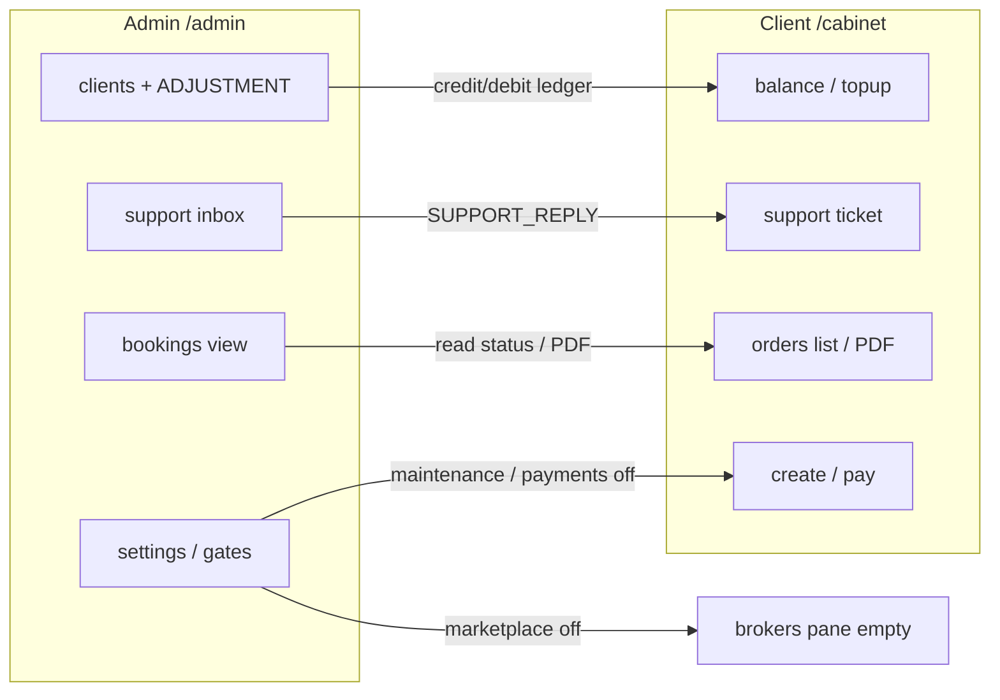
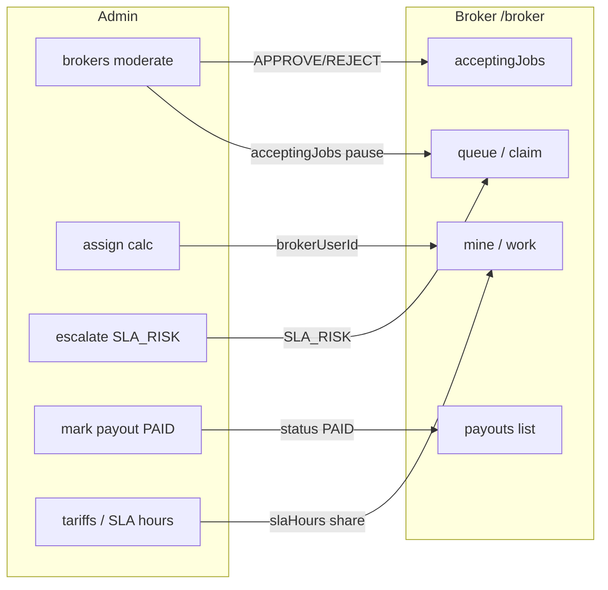
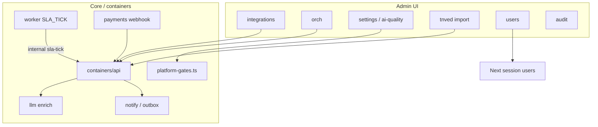

# Admin — схема панели и взаимодействий

Карта **существующих**, **обязательных для работы** и **будущих** взаимодействий VED admin (`/admin`).  
Ops-контур: D28 · [`../../admin-ops.md`](../../admin-ops.md) · UI сводка: [`../ui-guide.md`](../ui-guide.md) · инвентарь экранов: [`README.md`](./README.md).

**Demo:** `admin@example.com` / `operator@example.com` · `demo1234`.  
**Не путать** с SUPER CMS (`/2178737`) — posts, SEO, infra — D6, obscure path only.

---

## 1. Место админа в продукте

```text
                         ┌─────────────────────────────────────┐
                         │           PLATFORM (ядро)            │
                         │  ledger · D8 FSM · gates · orch D26  │
                         └──────────────┬──────────────────────┘
                                        │
     ┌──────────────────────────────────┼──────────────────────────────────┐
     │                                  │                                  │
┌────▼─────┐                    ┌───────▼────────┐                 ┌────────▼────────┐
│ CLIENT   │  pay / create      │    BROKER      │  claim/approve  │     ADMIN       │
│ /cabinet │ ─────────────────► │    /broker     │ ───────────────►│     /admin      │
│ job: PDF │  QUEUED/IN_REVIEW  │ job: QC + PDF  │  DONE+payout    │ job: ops+gates  │
└────┬─────┘                    └───────┬────────┘                 └────────┬────────┘
     │                                  │                                  │
     │ SUPPORT (platform)               │ CALCULATION chat                 │ assign/escalate
     │                                  │ (не SUPPORT)                     │ ADJUSTMENT/PAID
     └──────────────────────────────────┴──────────────────────────────────┘
                                        │
                              staff SUPPORT inbox
                              (только ADMIN, не брокер)
```

**Админ — оператор платформы**, не участник просчёта по умолчанию. Вмешивается когда нужно: assign, escalate, модерация, деньги, toggles, staff-support.

---

## 2. Карта экранов → API → эффект

| Группа | Экран | Route | API (основное) | Кого затрагивает |
|--------|-------|-------|----------------|------------------|
| **Операции** | Дашборд | `/admin` | `GET calculations`, aggregates local | — (read + deep-link) |
| | Заявки | `/admin/bookings` | `GET calculations?q&status` · `GET/assign/escalate calc` · PDF | Broker queue/mine · Client status |
| | Клиенты | `/admin/clients` | `GET company/list` · `GET|PATCH company/[id]` · `POST adjust` | Client/Manufacturer profile · segment · balance |
| | Брокеры | `/admin/brokers` | `GET brokers?all=1` · `PATCH brokers` (status, acceptingJobs, profile) | Broker queue/claim · Client BrokersPane |
| | Поддержка | `/admin/support` | `GET chat?scope=support&box` · POST chat · SUPPORT_STATUS | Client SupportPane |
| | Финансы | `/admin/finance` | `GET payouts` · `PATCH payouts` (PAID) · CSV client-side | Broker PayoutsPane |
| **Каталог** | Тарифы | `/admin/tariffs` | `GET tariffs` · `POST tariffs/update` | Pay amount · broker share · SLA |
| | ТН ВЭД | `/admin/tnved` | форма · CSV preview · JSON · search | Broker HS autocomplete |
| | AI-качество | `/admin/ai-quality` | `GET/PATCH platform/settings` | Express DONE vs QUEUED · LLM enrich |
| **Платформа** | Пользователи | `/admin/users` | `GET/POST /api/admin/users` · PATCH reset | Login access (no SUPER) |
| | Интеграции | `/admin/integrations` | `GET platform/integrations` · toggles via settings | payments/llm/notify paths |
| | Оркестрация | `/admin/orch` | `GET platform/orch` · POST retry | Worker jobs · Outbox · **ServiceCall** (ocr describe/reset, llm classify) |
| | Журнал | `/admin/audit` | `GET /api/admin/audit` | Audit trail (no SUPER rows) |
| | Настройки | `/admin/settings` | `PATCH platform/settings` | All gates (см. §4) |

Deep-link: `/admin/bookings?id=` · `/admin/clients?company=`.  
Nav badges: «Заявки» = QUEUED+SLA_RISK count · «Поддержка» = staff unread (`waitingOn=BROKER`).

---

## 3. Схема взаимодействий по акторам

### 3.1 Admin ↔ Client



| Взаимодействие | Направление | Механизм | Статус |
|----------------|-------------|----------|--------|
| Корректировка баланса | Admin → Client | `POST company/[id]/adjust` → `LedgerEntry` | **live** |
| Реквизиты / сегмент | Admin → Client | `PATCH company/[id]` (`clientSegment` только CLIENT) | **live** |
| Реквизиты завода | Admin → Manufacturer | тот же `PATCH` + stats SKU/пулы в drawer | **live** |
| Ответ на SUPPORT | Admin → Client | `POST chat` SUPPORT_REPLY · `waitingOn=CLIENT` | **live** |
| Close / Archive ticket | Admin → Client | `SUPPORT_STATUS` | **live** |
| Блок create/pay | Admin → Client | `maintenanceMode` / `paymentsEnabled` | **live** |
| Скрыть маркетплейс брокеров | Admin → Client | `marketplaceEnabled` | **live** |
| Просмотр заявок клиента | Admin read | company drill-down · bookings | **live** |
| Assign брокера на заявку | Admin → Client UX | calc → `IN_REVIEW` · client видит «у брокера» | **live** |

### 3.2 Admin ↔ Broker



| Взаимодействие | Направление | Механизм | Статус |
|----------------|-------------|----------|--------|
| Модерация брокера | Admin → Broker | `PATCH brokers` moderationStatus | **live** |
| Пауза приёма | Admin → Broker | `acceptingJobs: false` → queue [] + claim block | **live** |
| Профиль брокера | Admin → Broker | `PATCH brokers` specialization / languages / about | **live** |
| Assign заявки | Admin → Broker | `POST calculations/[id]/assign` | **live** |
| Escalate SLA | Admin → Broker | `POST calculations/[id]/escalate` | **live** |
| Выплата PAID | Admin → Broker | `PATCH payouts` | **live** |
| Тариф / доля / SLA | Admin → Broker | `tariffs/update` | **live** |
| Auto-assign после pay | Platform → Broker | `autoAssignBrokers` (admin toggle) | **live** |

**Запрещено по канону:** брокер **не** отвечает на SUPPORT; admin **не** правит mapping HS (это broker job, D15).

### 3.2b Admin ↔ Manufacturer

| Взаимодействие | Направление | Механизм | Статус |
|----------------|-------------|----------|--------|
| Список заводов | Admin read | `/admin/clients` filter `MANUFACTURER` | **live** |
| Реквизиты завода | Admin → Manufacturer | `PATCH company/[id]` (без `clientSegment`) | **live** |
| KPI SKU / пулы | Admin read | `manufacturerStats` в GET company | **live** |
| Инвайт пользователя | Admin → Manufacturer | `/admin/users` role MANUFACTURER → company create | **live** |

**Hold:** admin CRUD каталога SKU; оплата MOQ; публичный signup завода.

### 3.3 Admin ↔ Platform / Infra



| Взаимодействие | Admin UI | Domain | Статус |
|----------------|----------|--------|--------|
| Feature toggles | settings, integrations | `platform-gates.ts` + dual-path | **live** |
| Integrations health | integrations | ServiceCall + masked env host | **live** |
| Orch snapshot + retry | orch | BackgroundJob / ServiceOutbox D26 | **live** |
| ТН ВЭД batch | tnved | Prisma `TnvedCode` upsert | **live** (MVP batch; full dump = Track B) |
| Users CRUD (no SUPER) | users | `/api/admin/users` | **live** |
| Audit read | audit | filter SUPER rows | **live** |
| SLA tick (фон) | — | `POST /api/v1/internal/sla-tick` + worker | **live** (smoke needs secret) |

**Не в ADMIN UI (только env):** raw `PAYMENTS_SERVICE_URL`, API keys, `LLM_SERVICE_URL` — D28.

### 3.4 Admin ↔ SUPER CMS (разделение)

| Surface | Route | Кто | В VED admin nav? |
|---------|-------|-----|------------------|
| VED ops | `/admin/*` | ADMIN | **да** — 14 пунктов |
| Legacy CMS | `/2178737/*` | SUPER_ADMIN | **нет** — redirect с `/admin/posts`… |
| Infra env panel | SUPER `/infra` | SUPER only | **нет** |

---

## 4. Platform gates — что админ включает и что ломает

| Toggle | Admin pane | Эффект на клиента | Эффект на брокера | API enforce |
|--------|------------|-------------------|-------------------|-------------|
| `marketplaceEnabled` | settings | BrokersPane пуст | — | `resolveBrokersListFilter` |
| `autoAssignBrokers` | settings | После pay → сразу IN_REVIEW | Появляется в mine без claim | pay flow |
| `maintenanceMode` | settings | create/pay blocked | — | `assertNotInMaintenance` |
| `paymentsEnabled` | settings | topup/pay blocked | — | `assertPaymentsEnabled` |
| `llmEnrichEnabled` | ai-quality | — (draft quality) | AI fields на work | `requestAiDraft` |
| `notifyEnabled` | integrations | — | — | outbox kick |
| `mockTopupAllowed` | settings | mock topup | — | AND `ALLOW_MOCK_TOPUP` env |
| `confidenceThreshold` | ai-quality | Express DONE vs queue | — | pay → status |
| `defaultSlaHours` / `preferredClaimHours` | ai-quality | — | SLA deadline · reserved window | pay / claim |
| Broker `acceptingJobs` | brokers | — | queue hidden · claim block | gates + queue API |
| Broker moderation | brokers | REJECTED → нет в списке | не claim | brokers list |

---

## 5. Сквозные сценарии (admin touchpoints)

### S-OPS-1 — Заявка застряла

```text
Client pay → QUEUED
  → [optional] autoAssign → IN_REVIEW
  → OR broker claim → IN_REVIEW
  → broker approve → DONE

Admin touchpoints:
  · bookings: assign broker (override preferred)
  · bookings: escalate → SLA_RISK (attention + broker queue)
  · dashboard: attention list
  · settings: autoAssign on/off
  · brokers: acceptingJobs / moderation
```

### S-OPS-2 — Деньги клиента

```text
Client topup (mock/card) → ledger
Client pay → tariff charge
Admin: clients → ADJUSTMENT (±₽ + reason + audit)
Admin: finance → mark broker payout PAID
```

### S-OPS-3 — SUPPORT (не чат брокера)

```text
Client POST support thread (SUPPORT)
  → ticketStatus OPEN · waitingOn=BROKER (staff queue)
Admin /support: reply → waitingOn=CLIENT
  → resolve / archive / reopen
Broker /broker/chat — только CALCULATION threads
```

### S-OPS-4 — Инцидент интеграции

```text
notify/email stuck → admin /orch → retry outbox FAILED/DEAD
LLM down → llmEnrichEnabled off OR heuristic-only (fail-open)
payments down → paymentsEnabled off + maintenance message
```

### S-OPS-5 — Онбординг брокера

```text
Broker registers (internal) → PENDING
Admin /brokers → APPROVE → visible in client marketplace (if on)
Admin → acceptingJobs true → может claim
```

---

## 6. Матрица: существует / обязательно / будущее

### 6.1 Экраны и действия

| Capability | Существует (live) | Обязательно для ops | Будущее / hold |
|------------|-------------------|---------------------|----------------|
| Dashboard attention | ✓ | ✓ | — |
| Bookings list + drawer | ✓ | ✓ | — |
| Assign / escalate | ✓ | ✓ | — |
| Clients drill-down | ✓ | ✓ | — |
| ADJUSTMENT ledger | ✓ | ✓ | — |
| Broker moderate + pause | ✓ | ✓ | — |
| Support inbox 4 folders | ✓ | ✓ | — |
| Finance filter + CSV + PAID | ✓ | ✓ | DOCS_REQUESTED step (roadmap) |
| Tariffs edit | ✓ | ✓ | — |
| TN VED batch import | ✓ | ✓ (MVP) | **full nomenclature Track B** |
| AI-quality / settings form | ✓ | ✓ | dedupe shared pane |
| Integrations health | ✓ | ✓ | no URL editor (permanent hold) |
| Orch retry | ✓ | ✓ | auto-retry policies (future) |
| Users create/reset | ✓ | ✓ | — |
| Audit read | ✓ | ✓ | — |
| Nav groups 3 sections | ✓ | ✓ | — |
| Admin pane split | 14/14 panes | **done** (M2) | orchestrator + `ved/admin/*` |
| Admin empty states | all ops panes | **done** (M0.3) | `VedEmptyState` — [`ux-saas.md`](../ux-saas.md) §8 |
| Cmd+K global search | — | нет | **hold** |
| Manufacturer admin invite | — | нет (Growth) | D29 partner v1 |
| Buyer closed-groups admin | — | нет | D29 Ecosystem TBD |
| SUPER in VED nav | — | **запрещено** | obscure CMS only |

### 6.2 Взаимодействия с другими ролями

| Link | Существует | Обязательно | Будущее |
|------|------------|-------------|---------|
| Admin assign → broker mine | ✓ | ✓ | — |
| Admin escalate → SLA_RISK | ✓ | ✓ | notify on SLA (M3 Resend) |
| Admin ADJUSTMENT → client balance | ✓ | ✓ | — |
| Admin SUPPORT → client thread | ✓ | ✓ | — |
| Admin PAID → broker payouts | ✓ | ✓ | — |
| Admin gates → client create/pay | ✓ | ✓ | — |
| Admin gates → broker queue | ✓ | ✓ | — |
| Admin tnved → broker autocomplete | ✓ | partial (batch) | full search UI Track B |
| Broker → SUPPORT | **нет** (by design) | **не нужно** | — |
| Admin → mapping HS | **нет** (by design) | **не нужно** | — |
| Client shipping admin view | API only | нет MVP | shipping UI flag Growth |
| Worker SLA tick → admin UI | API internal | ✓ ops | smoke + cron docs |

### 6.3 UI / архитектура

| Item | Сейчас | Цель |
|------|--------|------|
| Orchestrator size | ~816 LOC + panes | done |
| Empty states | all ops panes VedEmptyState | done |
| Soft poll | manual refresh | optional 45s on orch/support |
| Mobile admin | flat chips 14 items | acceptable MVP; groups desktop only |

---

## 7. Сборка admin panel — что входит в «готовый» контур

**Минимум для ежедневной работы staff (без Growth):**

1. **Операции:** dashboard → bookings (assign/escalate) → clients (adjust) → brokers (moderate/pause) → support (reply) → finance (PAID).
2. **Каталог:** tariffs · tnved batch · ai-quality thresholds.
3. **Платформа:** users · integrations health · orch retry · audit · settings/gates.

**Не входит в VED admin (осознанно):**

- SUPER CMS content/SEO/infra
- Редактирование env URLs/keys
- Broker-style mapping/approve
- Client-style create/pay wizard
- Shipping ops UI (flag off)
- Manufacturer/partner cabinet (D29 later)

---

## 8. Следующие шаги реализации (UI)

Порядок из [`../ui-guide.md`](../ui-guide.md) §7:

| Шаг | UI работа | Взаимодействия не меняются |
|-----|-----------|----------------------------|
| **A** | Pane split AdminVedCabinet | **done** |
| **B** | VedEmptyState на dash/finance/orch + lists | **done** |
| **C** | Clients → drawer | **done** | `AdminCompanyDetailDrawer` |
| **D** | HS heuristic client (M1.2) | admin ai-quality уже есть |
| **E** | Partner v1 admin invite (Growth) | новые API + role ADR |

---

## 9. Проверка схемы

| Проверка | Команда / артефакт |
|----------|-------------------|
| Domain gates | `npm run test:unit` · `platform-gates.test.ts` |
| Admin paths | `admin-paths.test.ts` · `ADMIN_CABINET_PATHS` |
| Cross-role correctness | [`../shared/correctness.md`](../shared/correctness.md) |
| Live chain | [`../../chain-verification.md`](../../chain-verification.md) · smoke mvp/full/broker |
| Manual C↔B↔A | [`../../staging.md`](../../staging.md) |

---

## 10. Связанные документы

| Документ | Содержание |
|----------|------------|
| [`README.md`](./README.md) | Инвентарь экранов + platform settings table |
| [`interactions.md`](./interactions.md) | Краткая таблица действие → эффект |
| [`../ui-guide.md`](../ui-guide.md) | Сравнение client/broker/admin + UI roadmap |
| [`../../admin-ops.md`](../../admin-ops.md) | D28 toggles, integrations, SUPER hide |
| [`../../core-dialogues.md`](../../core-dialogues.md) | S1–S6 + envelopes |
| [`../../branches.md`](../../branches.md) | Ownership ветвей |
| [`../../plan-tech-debt.md`](../../plan-tech-debt.md) | Step 7 pane split |
