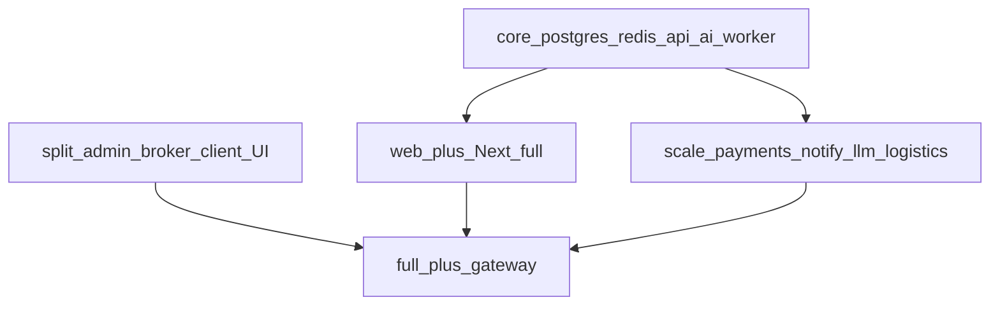

# Ответвления контейнеризации

Карта слоёв Compose и рекомендуемый порядок extract.  
Инварианты UI без Prisma: D16/D17/D20. Каркас: D18 / [`skeleton.md`](./skeleton.md).  
Порядок веток: ADR **D19**. Orchestration: [`../containers.md`](../containers.md), [`docker-compose.yml`](../../docker-compose.yml).

## Как устроено сейчас

Compose-профили задают **слои** контейнеризации:

| Профиль | Содержимое | Зачем | Команда |
|---------|------------|--------|---------|
| `core` | postgres, redis, api, ai, worker | бэкенд без UI | `npm run docker:core` |
| `web` | + `web:3000` (полный Next) | локальный аналог Vercel | `npm run docker:web` |
| `split` | admin + broker + client UI | параллельная разработка кабинетов | `npm run docker:split` |
| `scale` | + payments, notify, llm, logistics | growth-инфра | `npm run docker:scale` |
| `full` | всё + gateway `:8080` | интеграционный стенд | `npm run docker:full` |

**Продуктовые ветви** ([`branches.md`](./branches.md)) ↔ контейнеры:

| Продуктовая ветвь | Контейнеры | Статус extract |
|-------------------|------------|----------------|
| 1 Клиент | `containers/client` (:3003) | Next UI **D17** в репо; прод Vercel = `/cabinet` в корневом Next |
| 2 Брокер | `containers/broker` (:3002) | Next UI **D16** в репо; прод = `/broker` + panes; preferred timeout в domain |
| 4 Производитель | `containers/manufacturer` (:3004) | Next UI **D31**; прод = `/manufacturer`; не D8 FSM |
| 3 Ядро | `api`, `ai`, `worker` | **C1** dual-path (Compose `USE_DOMAIN_API=1`); Vercel = Prisma in Next |
| Growth | `payments`, `notify`, `llm`, `logistics` | **C4** envelopes + opt-in providers ([`growth.md`](./growth.md)) |
| Landing / CMS | `web`, `admin` Next VED | admin **D20** extract; CMS в web (D6) |

Инварианты: UI-контейнеры **без Prisma** (D16/D17/D20); каркас D18 не ломать.

## Прод (Vercel) vs Compose

| Surface | Vercel prod | Compose (`docker:core` / `full`) |
|---------|-------------|----------------------------------|
| Domain | Prisma внутри Next; **не** ставить `USE_DOMAIN_API` | `USE_DOMAIN_API=1` → `containers/api` |
| AI | in-process heuristic (`ai-draft-engine`) | `ai:4100` ± optional `llm` (stub/OpenAI) |
| SLA | Cron → `POST /api/v1/internal/sla-tick` (internal key) | Worker interval → api, fallback web |
| Payments / notify | mock topup / absent | scale: stub или ЮKassa / email по env |

## Уже в репозитории

1. **Surface broker** — [`containers/broker`](../../containers/broker/) Next, gateway `/broker-app/`; Vercel `/broker` panes.
2. **Surface client** — [`containers/client`](../../containers/client/) Next, gateway `/client-app/`; Vercel `/cabinet` panes.
3. **Surface admin** — [`containers/admin`](../../containers/admin/) Next VED, gateway `/admin-app/` (D20).
4. **Worker + sla-tick** — `SLA_TICK` → api (fallback web); durable `BackgroundJob` + `OUTBOX_DRAIN` (D26); Vercel cron hits Next internal route.
5. **API extract (C1)** — mutations в [`containers/api`](../../containers/api/) при `USE_DOMAIN_API=1`.
6. **Orchestration tables (D26)** — `background_jobs`, `service_outbox`, `service_calls`; contracts `d-orch.core.json`.
7. **Stability scaffold** — `npm run test:structure` + contracts (D18).
8. **Gateway auth smoke** — `npm run smoke:gateway` ([`web-slim.md`](./web-slim.md)).

## C1–C5 (честный статус)

| ID | Статус | Комментарий |
|----|--------|-------------|
| C1 | **Compose ready / Vercel dual** | Domain API полный в `containers/api`; Vercel остаётся Prisma-in-Next |
| C2 | **Done (D20)** | Admin Next surface |
| C3 | **Heuristic-v1** | ± optional OpenAI via llm; не менять `/v1/draft` |
| C4 | **Opt-in providers** | stub default; ЮKassa / Resend\|SMTP / demo-3pl по env |
| C5 | **Scaffold + gateway smoke** | [`web-slim.md`](./web-slim.md); `npm run smoke:gateway`; Vercel full monolith UI until cutover |

## Gateway paths

| Path | Upstream |
|------|----------|
| `/` | `web:3000` |
| `/admin-app/` | `admin:3001` |
| `/broker-app/` | `broker:3002` |
| `/client-app/` | `client:3003` |
| `/manufacturer-app/` | `manufacturer:3004` |
| `/api/domain/` | `api:4000` |
| `/api/v1/ai/` | `ai:4100` |
| `/api/worker/` | `worker:4200` |
| `/api/payments/` | `payments:4300` |
| `/api/notify/` | `notify:4400` |
| `/api/llm/` | `llm:4500` |
| `/api/logistics/` | `logistics:4600` |
| `/api/ocr/` | `ocr:4700` (fail-open create; also internal `OCR_SERVICE_URL`) |
| `/health` | gateway liveness JSON |

## Инвентарь as-is / будущее

Полный список 14 сервисов + приоритеты P1a/P1b–P3: [`../containers.md`](../containers.md), [`../../containers/README.md`](../../containers/README.md) §«Что добавлять».

| Группа | Сервисы |
|--------|---------|
| Infra | postgres, redis, gateway |
| Ядро | api, ai, worker |
| Growth | payments, notify, llm, logistics, **ocr** (fail-open wire) |
| UI | web, admin, broker, client |

| Приоритет | Стратегия |
|-----------|-----------|
| **P1a** | D27/polish: notify email, worker orch, admin orch UI, api tnved/settings, heuristic ai, C5 web-slim |
| **P1b** | Growth (после D27): llm, logistics 3PL, payments ЮKassa |
| **P2** | OCR stub service **`ocr`** (:4700) — scaffold **done**; create fail-open when `OCR_SERVICE_URL` set |
| **P3** | По триггеру: observability, pdf, media; Redis job broker при нагрузке |

**Антипаттерны:** не дробить UI/postgres/redis/gateway; не выносить support/tnved/sms в отдельные сервисы на старте. При правках KB упоминать D27 + эти приоритеты ([`README.md`](./README.md) §Правила обновления KB п.11).

ADR **D19:** не дробить postgres/redis/gateway как product branches. UI без Prisma (D16/D17/D20).

## Параллельная ownership (D35)

Логические пакеты domain (не обязательно отдельные Docker):

| Пакет | Зона кода | Параллельный трек |
|-------|-----------|-------------------|
| UI cabinets | `containers/{client,broker,admin,manufacturer}` + `src/components/ved/*` | ветви 1/2/4 |
| domain | `src/lib/ved` (domain) + `containers/api` | FSM / ledger / dual-path |
| orch | `ai-drain-*`, `jobs-tick`, `worker` | retries / ticks |
| mesh | `provider-mesh`, `openai-compat` | chains / Vercel direct |
| draft | `containers/ai`, heuristic rules | `/v1/draft` |
| AI matrix | репо **`llm`** `services/*` | classify / ocr / future capability |

**Model ≠ container.** DeepSeek/Qwen/… = профили + `LLM_CLASSIFY_CHAIN`.  
**Capability = сервис** (`classification`, `ocr`, позже risk/documents).  
Mirrors: `npm run sync:ai-matrix`. Compose build from matrix: `LLM_DOCKER_CONTEXT` / `OCR_DOCKER_CONTEXT`.  
Карта файлов: [`../../src/lib/ved/PACKAGES.md`](../../src/lib/ved/PACKAGES.md) · план [`plan-parallel-ownership.md`](./plan-parallel-ownership.md).

## Диалоги и контракты

[`core-dialogues.md`](./core-dialogues.md), envelopes [`../contracts/`](../contracts/).
