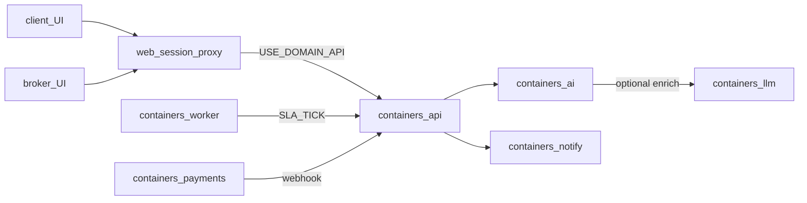

# Диалоги ядра (client / broker / llm)

Форматы взаимодействия ветки **3 Ядро** с клиентом, брокером и LLM.  
Контракты (JSON Schema): [`../contracts/`](../contracts/).  
Контейнеры: [`containerization.md`](./containerization.md). Ветви: [`branches.md`](./branches.md).

Инварианты: статусы **D8**, очередь только после pay (**D11**), реальные `CalculationItem` (**D15**), UI без Prisma, LLM только через `containers/ai`.  
Очередность записей в Postgres и инвентарь обязательных моделей: [`db-process.md`](./db-process.md) (**D23**).

## Матрица «кто с кем говорит»

- Браузер **не** вызывает `api:4000` / `llm:4500` напрямую (session `/api/v1` на web → proxy).
- LLM **не** мутирует расчёты и не пишет в Postgres.
- Upload файлов остаётся на web (`POST /api/v1/uploads`); в draft уходят text-поля, не бинарник.

## Envelopes

| ID | Участники | Транспорт | Контейнер-владелец | Контракт |
|----|-----------|-----------|--------------------|----------|
| `D-DRAFT` | api ↔ ai (↔ llm) | `POST /v1/draft` | [`containers/ai`](../../containers/ai), enrich [`llm`](../../containers/llm) | [`d-draft.ai.json`](../contracts/d-draft.ai.json), [`d-draft.llm.json`](../contracts/d-draft.llm.json) |
| `D-CALC` | client → core | create / get / pay | [`containers/api`](../../containers/api) | [`d-calc.client.json`](../contracts/d-calc.client.json) |
| `D-QUEUE` | broker → core | list queue/mine, claim | api | [`d-queue.broker.json`](../contracts/d-queue.broker.json) |
| `D-MAP` | broker → core | PATCH items, approve | api | [`d-map.broker.json`](../contracts/d-map.broker.json) |
| `D-THREAD` | client ↔ broker via core | GET/POST chat | api | [`d-thread.chat.json`](../contracts/d-thread.chat.json) |
| `D-LEDGER` | client / payments → core | pay, topup, webhook | api + [`payments`](../../containers/payments) | [`d-ledger.json`](../contracts/d-ledger.json) |
| `D-EVENT` | core → notify | `POST /v1/send` | [`notify`](../../containers/notify) | [`d-event.notify.json`](../contracts/d-event.notify.json) |
| `D-JOB` | worker → core | sla-tick / jobs | [`worker`](../../containers/worker) | [`d-job.worker.json`](../contracts/d-job.worker.json) |
| `D-SHIP` | client → core → logistics | quotes after DONE | api + [`logistics`](../../containers/logistics) | [`d-ship.logistics.json`](../contracts/d-ship.logistics.json) |
| `D-PRODUCT` | client → core | `items[].attrs` (D24) | api | [`d-product.calc.json`](../contracts/d-product.calc.json) |
| `D-TNVED` | core reference | TN VED tree / rates (D24) | api | [`d-tnved.core.json`](../contracts/d-tnved.core.json) |
| `D-HISTORY` | core trail | `CalculationEvent` (D24) | api | [`d-history.calc.json`](../contracts/d-history.calc.json) |

## Запрещённые диалоги

| Не делать | Почему |
|-----------|--------|
| client → llm напрямую | LLM за `ai`; UI видит только calc/items |
| broker правит `TariffPlan.priceRub` | D15 — только HS/duty/VAT/fee по позициям |
| AI/chat → `QUEUED` без pay | D11 |
| `id: "synthetic"` items | D15 |
| UI-контейнеры с Prisma | D16/D17/D20 |
| shipping до `DONE` | D15 |

## Сценарии

### S1 — Клиент: create + draft

1. Client UI → `POST /api/v1/uploads` (S3 when `S3_*`, else local FS; on Vercel S3 required; UI показывает API `error`) → `mediaUrl` на item.
2. Client → `POST /api/v1/calculations` (**D-CALC**, + optional preferredBrokerUserId) → api create.
3. Api → **D-DRAFT** `ai POST /v1/draft` → optional llm classify/duty (**S6**).
4. Persist `hsCodeAi`, duty/VAT split, `aiDraft` → status `AI_READY`.
5. Ответ клиенту: calculation + items (не сырой llm JSON). Картинка **не** уходит в LLM (attachment only).

Клиентский раздел «Перевозка» после DONE — domain API готов; **UI по умолчанию скрыт** (`NEXT_PUBLIC_SHIPPING_UI`, см. [`growth.md`](./growth.md)).

### S2 — Клиент: pay → очередь или Express DONE

1. `POST …/pay` (**D-LEDGER** charge company balance).
2. STANDARD/PRO → `QUEUED` (**D11**).
3. EXPRESS + high confidence → `DONE` + `pdfHtml` без брокера.
4. EXPRESS + low conf → `QUEUED`.

### S3 — Брокер: claim → mapping → approve

1. `GET …?scope=queue` → `POST …/claim` (**D-QUEUE**) → `IN_REVIEW` + chat thread.
2. Читает persisted AI fields (`hsCodeAi`, duty/VAT) + optional `items[].attrs`; LLM не вызывает.
3. `PATCH …/items` (**D-MAP**) — правка HS/duty/VAT/fee; статус остаётся `IN_REVIEW`.
4. Опционально: `POST …/escalate` (own `IN_REVIEW`) → `SLA_RISK` (admin также QUEUED→SLA_RISK).
5. `POST …/approve` → `DONE` + PDF + payout + **D-EVENT** `calc.approved`.

### S4 — Чат client ↔ broker

Только **D-THREAD**: `body`, optional `attachmentUrl`, flip `waitingOn` CLIENT↔BROKER.  
Не меняет статус на `QUEUED` и не обходит pay.  
UI: broker `ChatThreadsPane` + nav unread (`GET chat?scope=unread` для BROKER = `waitingOn=BROKER`). Soft poll 45с + «Обновить».  
Client: OrderChat + SupportPane; unread badge «Заявки»+«Поддержка» (`waitingOn=CLIENT`); deep-link `/cabinet/orders?id=`.

### S5 — SLA / jobs

Worker (**D-JOB**) → `POST /v1/internal/sla-tick` (api, fallback web) → escalate overdue / release preferred → optional **D-EVENT** `calc.sla_risk`.  
Ручной escalate: admin (QUEUED\|IN_REVIEW) или broker (own IN_REVIEW) → `POST …/escalate`.

### S6 — LLM enrich only

`api create` → `ai` → if `LLM_SERVICE_URL`: classify + duty ([`enrich-llm.js`](../../containers/ai/src/enrich-llm.js)).  
Ошибка llm → heuristic draft без fail create (unit: `ai-llm-failopen.test.ts`). UI не участник.  
Provider stub или OpenAI — см. [`ai-pipeline.md`](./ai-pipeline.md) / [`growth.md`](./growth.md).

## Параллельная разработка (ownership)

| Контейнер / пакет | Контракты | Параллельный фокус |
|-------------------|-----------|-------------------|
| `containers/api` + domain | d-calc, d-queue, d-map, d-thread, d-ledger | domain routes / proxy parity |
| `containers/ai` + draft | d-draft.ai | draft engine; вызов llm |
| **`llm` repo** `classification` (mirror `containers/llm`) | d-draft.llm | classify/duty + provider profiles/chains |
| **`llm` repo** `ocr` (mirror `containers/ocr`) | d-ocr.ai | extract / vision |
| orch (`worker`, AI_DRAIN) | d-orch.core, d-job | retries, ticks — не UI |
| mesh (`provider-mesh`) | — (env) | Vercel direct providers; UI не зовёт |
| `containers/notify` | d-event | template catalog |
| `containers/payments` | d-ledger (webhook side) | checkout / confirm |
| `containers/logistics` | d-ship | quotes after DONE |
| UI surfaces | session API | client / broker / admin / manufacturer |

Один PR = один пакет/контейнер + свои файлы в `docs/contracts/` (**D19** / **D35**). Не смешивать extract payments+AI в одном PR.  
Новая **модель** ≠ новый контейнер — profile/chain. Канон: [`plan-parallel-ownership.md`](./plan-parallel-ownership.md).

## Как тестировать

Матрица ветвей, дубли и команды ↔ S1–S6: [`testing-branches.md`](./testing-branches.md).

| Сценарий | Команда |
|----------|---------|
| S1–S3 spine | `npm run smoke:full` |
| S3 mapping PATCH | `npm run smoke:broker` |
| S4 chat | `npm run smoke:chat` |
| S5 sla-tick | `npm run smoke:sla` |
| D-SHIP pre-DONE | `npm run smoke:shipping` |
| C5 gateway | `npm run smoke:gateway` |
| Инварианты / contracts | `npm run test:ci` |

## Growth (не сейчас)

- SSE/WebSocket поверх **D-THREAD** (source of truth остаётся REST).
- `packages/ved-contracts` (typed import) после стабилизации JSON Schema.
- Vision/OCR: upload → отдельный сервис; не подменять **D-DRAFT** text contract.
- C5 slim cutover: только после зелёного `npm run smoke:gateway` ([`web-slim.md`](./web-slim.md)).
- Внешний carrier API / SMS — envelopes готовы; см. [`growth.md`](./growth.md).
