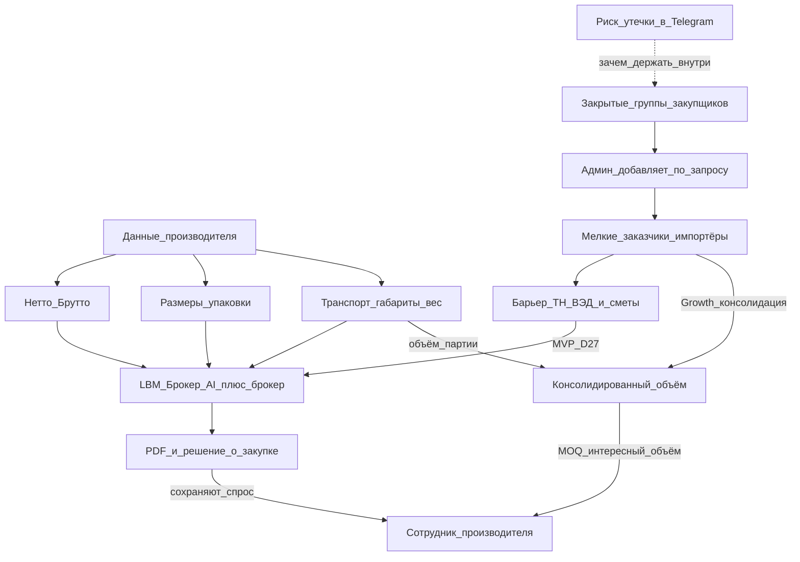

# Целевой клиент и ценность площадки

Канон persona / ценности / стратегических горизонтов.  
MVP-deliverable не меняет: [`product.md`](./product.md) §D27 · ADR [`decisions.md`](./decisions.md) **D27**.  
Стратегический слой: ADR **D29**.

Источники синтеза: product / D1–D2 / D5 / D11 / D15 / D27 · [`calculation-fields.md`](./calculation-fields.md) · [`growth.md`](./growth.md).  
Чат as-is: `ChatThread` `CALCULATION` / `SUPPORT` — не peer-группы.

**Vision ≠ as-is:** partner-кабинет производителя, консолидация объёмов, buyer-groups — **не** текущий CTA.

---

## 1. Целевой клиент

### 1.1 Primary MVP (D27) — импортёр

Частный / SMB **импортёр** — человек или небольшая компания, которая впервые или эпизодически ввозит товар и сначала хочет понять **код ТН ВЭД и стоимость таможенных платежей**, а не купить «логистику под ключ».

| Признак | По KB |
|---------|--------|
| Роль в системе | `CLIENT` (+ `Company`, баланс) — публичная регистрация **D25** |
| Не целевой сейчас | Enterprise ERP; публичная саморегистрация брокера; «доставка под ключ» как CTA |
| Воронка | 1) ТН ВЭД + смета → 2) брокер-QC → 3) PDF до оплаты поставщику → 4) логистика *позже* |
| Готовность платить | За **просчёт** (Экспресс / Стандарт / Профи), не за подписку (**D1**) |

### 1.2 Strategic persona — сотрудник производителя

**Кто:** менеджер / sales / экспорт / клиентский сервис у **производителя** (завод, бренд, дистрибьютор с номенклатурой); KPI — объём и маржа канала.

**Боль:** мелкие заказчики отваливаются, потому что:

- не понимают ТН ВЭД и таможенную смету;
- слишком малы для ручного сопровождения (WhatsApp/Excel);
- уходят к оптовикам — **производитель теряет хвост спроса**.

| Горизонт | Потребность | Стык с продуктом |
|----------|-------------|------------------|
| Сейчас (косвенно) | Мелкий покупатель сам получает ясность и доводит заказ | MVP импортёра (D27) |
| Дальше | Не вести каждого мелкого вручную | Платформа + брокер-QC как общий сервисный слой |
| Стратегия | Удержать мелких как **агрегированный объём** | Консолидация → партии (MOQ, отгрузка, цена) |
| Данные (вклад) | Эталонные веса/габариты SKU один раз | Master-data → attrs / карточка → AI, брокер, логистика |

### 1.3 Master-data от производителя

Мелкий импортёр часто **не знает** точных весов и габаритов; производитель — **источник истины**.

| Поле | Зачем | Статус as-is |
|------|-------|--------------|
| **Нетто** | Таможня / смета / AI draft | Schema: `attrs.netWeightKg` ([`product-description.ts`](../../src/lib/ved/product-description.ts)); soft у STANDARD/PRO |
| **Брутто** | Таможня + логистика | Schema: `attrs.grossWeightKg` (follow-up UI — [`calculation-fields.md`](./calculation-fields.md) §3) |
| **Размеры упаковки** (Д×Ш×В) | Упаковочный лист, OCR/AI | Канона в attrs **нет** — расширять schema / partner catalog |
| **Транспортные размеры + вес** | Quotes, консолидация, 3PL | **Нет** в MVP; стык shipping после `DONE` / Growth |

Partner surface производителя: **v1 запланирован** (SKU → attrs), не текущий CTA. Канон кабинета: [`cabinets/ux-saas.md`](./cabinets/ux-saas.md) §6.

Операционный QC: **брокер** — claim / mapping / SLA ≤ 4 ч после оплаты (**D11**); product attrs у брокера read-only.

### 1.4 Вектор — диалог между закупщиками

**Гипотеза:** после успешных просчётов закупщики начнут обмениваться опытом (коды, поставщики, брокер, консолидация). Такой разговор **с высокой вероятностью** сначала появится во внешних мессенджерах (Telegram). Без внутреннего контура сеть утекает наружу.

**Канон доступа (UX-формат TBD):**

| Правило | Смысл |
|---------|--------|
| Группы **закрытые** | Нет open join / публичного каталога |
| Вступление **по запросу** | Клиент подаёт request |
| Добавляет **админ** | Staff (`ADMIN`) approve/invite |
| Не путать с as-is чатом | `CALCULATION` / `SUPPORT` — не peer-группа |

Заранее в модели (при реализации): отдельный kind вроде `BUYER_GROUP` / `CommunityGroup`; membership `pending → approved`; позже опционально notify/mirror в Telegram (**не** путать с legacy CMS Telegram).

**Анти-scope:** публичный форум; Telegram-бот как MVP CTA; смешение с CALC/SUPPORT без отдельного типа.

---

## 2. Потребности и ценность

**Импортёр (ядро продукта):** уверенность в стоимости импорта **до оплаты поставщику**.

**Производитель (стратегия):** не терять мелких из‑за таможенной непрозрачности; со временем собирать их в объёмы, с которыми выгодно работать.

**Сеть закупщиков (вектор):** безопасный диалог **внутри** площадки — чтобы опыт и договорённости о консолидации не жили только в Telegram.

### MVP для импортёра (D27)

| Потребность | Как закрывается |
|-------------|-----------------|
| Код ТН ВЭД | AI draft + attrs, confidence, дисклеймер |
| Пошлина / НДС / сборы | Смета на `CalculationItem` → PDF |
| Не доверять «голому» AI | STANDARD/PRO → брокер-QC |
| Зафиксировать результат | PDF после `DONE` |

### Производитель / сеть — статус

| Потребность | Статус |
|-------------|--------|
| Мелкий не ломается на ТН ВЭД | Косвенно MVP |
| Общий QC без штата брокеров у завода | Частично: очередь брокеров (D11/D15) |
| Кабинет производителя / витрина SKU | **D31 live** `/manufacturer` (инвайт ADMIN) · [`cabinets/manufacturer/`](./cabinets/manufacturer/) |
| Эталонные нетто/брутто/габариты | Частично schema; габариты + feed — в v1 partner / Growth |
| Консолидация в партию (MOQ) | **D34 live** `/cabinet/factory` + `/manufacturer/pools` (qty-запрос → сборный заказ; не оплата MOQ / не отгрузка) |
| Закрытые группы закупщиков | Vision / Ecosystem (D29) |
| «Под ключ» | Hold (D27) |

### Не обещать в текущем CTA

- Консолидация объёмов как **лендинг-CTA** / публичная витрина завода / buyer-groups как лицо продукта  
- Кабинет производителя **в текущем CTA лендинга** (v1 — отдельная задача после UX трёх кабинетов, [`cabinets/ux-saas.md`](./cabinets/ux-saas.md))  
- Публичный форум / open Telegram-community  
- Shipping UI / live ЮKassa / LLM-as-CTA / полный каталог ТН ВЭД как go-live  

---

## 3. Уникальность и преимущество

Позиционирование: **AI-платформа импорта/ВЭД, а не сайт одного брокера.**

| От чего | Преимущество |
|---------|--------------|
| Сайт брокера | AI → очередь брокеров → PDF |
| Калькулятор ТН ВЭД | После тарифа — живой брокер-QC + SLA |
| CRM производителя | Снимает таможенный барьер у мелких, которых CRM не окупает |
| Опт «только от N» | MVP пускает мелких в ясность; Growth собирает в N |
| Открытый Telegram | Внутри: **закрытые группы**, только через админа |

Сеть:

- спрос — ТН ВЭД → QC → PDF;  
- предложение (позже) — консолидированный объём;  
- данные завода — считаемые веса/габариты;  
- peer-закупщики — диалог рядом с просчётом (Telegram — опциональные уведомления, не единственное место сети).

---

## 4. Прорывное решение

### Ядро (MVP / KB)

**AI первая линия → оплата за просчёт → брокер как QC → PDF — до оплаты поставщику.**

1. Смена порядка риска для импортёра.  
2. Гибрид AI + брокер, не замена брокера.  
3. Платформенная очередь QC, не визитка.  
4. Узкий честный MVP (**D27**).

### Стратегия (D29)

**Консолидация «хвоста»:** мелкий становится способным принять решение (ясность таможни) → агрегация намерений/заказов в объёмы, интересные производителю + **master-data** (нетто, брутто, упаковка, транспорт + вес).

**Сеть закупщиков:** закрытые группы (request → admin) удерживают peer-обмен на площадке; membership/moderation проектировать **до** выбора UI (лента / комнаты / topics).

---

## 5. Одной фразой

**MVP:** для частного/SMB импортёра — AI-черновик ТН ВЭД и сметы + опциональный брокер-QC и PDF, чтобы решить о закупке с уверенностью в таможенной стоимости.

**Стратегия:** для сотрудника производителя — сохранить «хвост» спроса, принять эталонные **нетто/брутто/габариты**, **консолидировать** мелких в интересные объёмы; параллельно — **закрытые группы диалога закупщиков** (запрос → админ), чтобы peer-обмен не жил только в Telegram.
