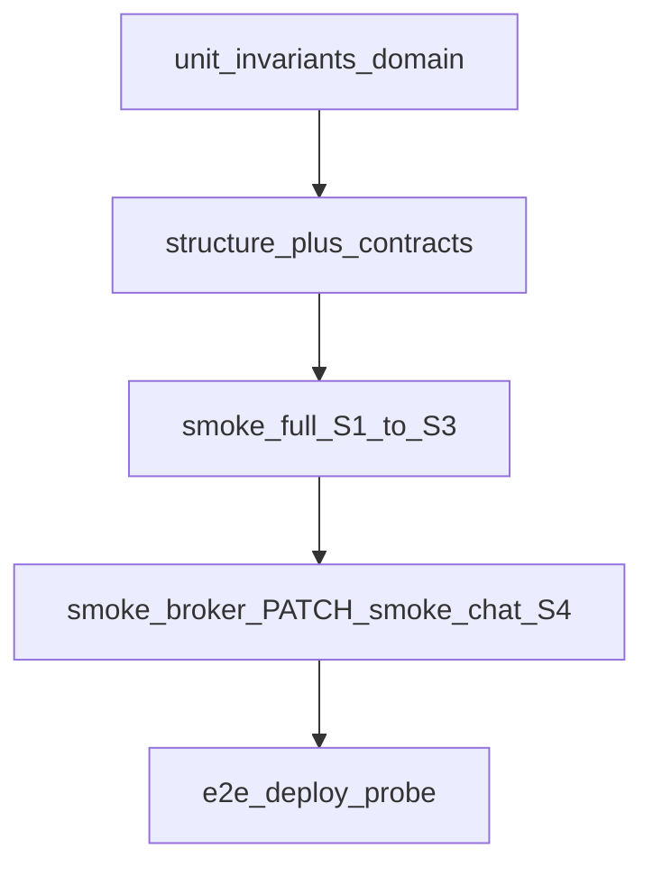

# Тестирование связей трёх ветвей

Матрица покрытия взаимодействий **клиент / брокер / ядро**.  
Сценарии диалогов: [`core-dialogues.md`](./core-dialogues.md). Контракты: [`../contracts/`](../contracts/).  
DB-очередность / tx (D23): [`db-process.md`](./db-process.md). Общий индекс: [`testing.md`](./testing.md).

## Слои и владение legs

| Слой | Владеет | Не владеет |
|------|---------|------------|
| Unit `src/lib/ved/__tests__` | D8/D10/D11/D15, pay/claim/approve, ledger, PATCH items, AI golden + fail-open | Live HTTP |
| `test:structure` + `test:contracts` | ownership, contracts files + examples | Runtime API |
| `smoke:full` | S1–S3 spine STANDARD (+upload attach); retry/timeout broker+PDF | PATCH correction, chat |
| `smoke:chain-llm` | Compose/local: upload POST+GET, create w/ `llmEnrich`, pay→broker→PDF | Vercel без corpus mount |
| `smoke:precedent-csv` | chain seed + second create `precedent-v1` + CSV `MATCHED_PRECEDENT` | Vercel / remote DB |
| `smoke:csv-import` | preview → create calc from CSV rows (STANDARD ≤3) | — |
| `smoke:pdf-import` | text-layer PDF → preview rows | scanned PDF / vision |
| `smoke:ocr-vision` | **TODO** — JPEG → `ocr-vision-v1` via extract-table | без `OPENAI_API_KEY`; см. [`plan-ocr-vision.md`](./plan-ocr-vision.md) |
| `smoke:reclassify` | broker feedback → LLM reclassify (IN_REVIEW) | Vercel без LLM |
| `smoke:precedent-vector` | chain seed + paraphrase → `precedent-v2` (pgvector) | без OPENAI_API_KEY / pgvector |
| `smoke:mvp` | Register → topup → S1–S3 (new CLIENT, seed broker); upload skip если S3 503; retry/timeout | Duplicate of full on seed user |
| `smoke:broker` | D-MAP PATCH → approve | Create/pay |
| `smoke:client` | EXPRESS shortcut (⊂ full) | STANDARD spine |
| `smoke:chat` | S4 POST/GET chat + `waitingOn` | Status machine |
| `smoke:sla` | S5 HTTP sla-tick | Domain unit alone |
| `smoke:shipping` | D-SHIP pre-DONE 400 | Happy-path DONE shipping |
| `smoke:gateway` | C5 gateway cookie → `/api/v1/me` | Slim cutover |
| `smoke:payments` | Topup stub/mock → balance↑ | Pending YooKassa OK without credit |
| E2E (`RUN_E2E=1`) | Auth + one client + one broker soft probe | Mapping PATCH, contracts |

**Anti-dupe:** e2e broker **не** обязан PATCH (владеет `smoke:broker`). E2e client — deploy probe, не замена `smoke:full`.

## Матрица Branch pair × сценарий

| Пара | Сценарий | Unit | Smoke | E2E | Примечание |
|------|----------|------|-------|-----|------------|
| client↔core | S1 create+draft | `calculations` create, `ai-draft-engine` | `smoke:full` | client-create-pay | Upload = attachment only |
| client↔core | S2 pay QUEUED/DONE | `payCalculation` | `smoke:full`, `smoke:client` | client-create-pay | soft QUEUED\|DONE в e2e |
| client↔core | D-SHIP after DONE | `logistics.test` + `shipping.test` + **opt-in** `shipping.integration` | **`smoke:shipping`** | hard reject pre-DONE + DONE→201 | DB suite: `npm run test:integration` |
| client↔core | D-LEDGER topup | `payments.test` (stub + pending YooKassa) | — | topup before pay | |
| broker↔core | S3 claim | `claimCalculation` | full + broker | broker-claim-approve | |
| broker↔core | S3 D-MAP PATCH | `saveCalculationItems` | **`smoke:broker` only** | — | e2e без PATCH |
| broker↔core | S3 approve DONE+PDF | approve + synthetic ban | full + broker | broker soft | notify `calc.approved` |
| client↔broker | S4 D-THREAD | claim creates thread (mock) | **`smoke:chat`** | — | |
| core↔ai | D-DRAFT | TS engine + golden rules | full logs llmEnrich? | — | |
| core↔ai↔llm | S6 enrich + corpus + precedent | **`ai-llm-failopen.test`** | **`smoke:chain-llm`**, **`smoke:precedent-csv`**, **`smoke:reclassify`** | — | compose local DB; `llmEnrichEnabled` |
| core↔worker | S5 SLA | `runSlaTick` + **`worker.test` stopWorker** | **`smoke:sla`** | — | interval clear + in-flight logistics; + notify `calc.sla_risk` |
| web↔api | SIGTERM shutdown | **`api-sigterm.smoke`** | — | — | `server.close` → `$disconnect` → exit 0 |
| core↔notify | D-EVENT | — | — | — | Templates aligned; email opt-in |
| web↔api | USE_DOMAIN_API | `domain-api.test` parity table | **`smoke:gateway`** | — | Live same-seed stand optional |

## Дубли (осознанные)

| Путь | Где | Правило |
|------|-----|---------|
| create→pay | unit + smoke:client + smoke:full + e2e | Unit=инварианты; spine=`smoke:full`; e2e=probe |
| claim→approve | unit + smoke:full + smoke:broker + e2e | Unit=RBAC; PATCH только broker smoke |
| D8 transitions | domain + invariants + security | Разные углы — не дубль сценария |

## Gaps (не ошибка тестов / отложено)

| Gap | Статус |
|-----|--------|
| «Доработка dropdown» | Фичи нет — не тестируем |
| Полный AJV | `test:contracts` = лёгкая проверка examples |
| Live Prisma↔api same-seed | Отдельный стенд; unit parity table закрывает shape/errors |
| C5 slim cutover | Только после стабильного `smoke:gateway` |
| TN VED search API / UI attrs / events list | D24 scaffold готов ([`data-model.md`](./data-model.md)); HTTP/UI — roadmap §2.5 |
| Unit `data-model-d24` | helpers + payload JSON; writers — `calculations.test.ts` |

## Команды ↔ S1–S6

| Команда | Сценарии |
|---------|----------|
| `npm run test:unit` | Инварианты + calc/ledger/AI golden + fail-open |
| `npm run test:structure` | Ownership / dual UI ban / shared AI rules |
| `npm run test:contracts` | `docs/contracts/*` envelopes |
| `npm run test:ci` | unit → structure → contracts → verify |
| `npm run smoke:full` | S1–S3 |
| `npm run smoke:chain-llm` | S1–S3 + upload GET + LLM enrich (compose) |
| `npm run smoke:precedent-csv` | precedent-v1 + CSV preview (compose local DB) |
| `npm run smoke:csv-import` | CSV preview → create |
| `npm run smoke:pdf-import` | PDF text-layer table preview |
| `npm run smoke:pdf-import` | PDF text-layer table preview |
| `npm run smoke:ocr-vision` | **TODO** — vision JPEG (skip без `OPENAI_API_KEY`) · [`plan-ocr-vision.md`](./plan-ocr-vision.md) |
| `npm run smoke:reclassify` | broker reclassify + feedback (compose LLM) |
| `npm run smoke:precedent-vector` | pgvector precedent-v2 (compose + OPENAI_API_KEY) |
| `npm run smoke:mvp` | Register → topup → S1–S3 |
| `npm run smoke:broker` | S3 mapping PATCH |
| `npm run smoke:client` | S2 EXPRESS niche |
| `npm run smoke:chat` | S4 |
| `npm run smoke:sla` | S5 sla-tick HTTP |
| `npm run smoke:shipping` | D-SHIP pre-DONE 400 |
| `npm run smoke:gateway` | C5 gateway auth cookie |
| `npm run smoke:payments` | Topup → ledger |
| `npm run test:e2e` | Deploy probe |

Prod smoke playbook и последние результаты: [`staging.md`](./staging.md). План фаз: [`roadmap.md`](./roadmap.md).

## Growth local — мониторинг спринта (OCR / LLM / precedent)

Чеклист для итераций compose/local (не prod CTA): [`plan-ocr-vision.md`](./plan-ocr-vision.md) · [`plan-precedent-bulk.md`](./plan-precedent-bulk.md).

| Область | Минимум green | Hold / skip OK |
|---------|---------------|----------------|
| Spine | `smoke:full` | — |
| LLM classify | `smoke:chain-llm` | Vercel без corpus |
| Precedent | `smoke:precedent-csv` | remote DB mismatch |
| Import | `smoke:csv-import`, `smoke:pdf-import` | — |
| pgvector | `smoke:precedent-vector` | нет `OPENAI_API_KEY` / pgvector image |
| Vision OCR | `smoke:ocr-vision` (**TODO**) | нет `OPENAI_API_KEY` |
| Broker QC | `smoke:reclassify` | Vercel без LLM |
| CI | `npm run test:ci` | — |

## Существующие алгоритмы (не плодить заново)

- Cookie/CSRF jar — `scripts/smoke-*-path.mjs` / `smoke-*-auth.mjs`
- Mock Prisma calc flows — `calculations.test.ts`
- Structure walk + forbidden synthetic — `verify-structure.cjs`
- Contract examples shape — `verify-contracts.cjs`
- Dialogue envelopes — `docs/contracts/d-*.json`
