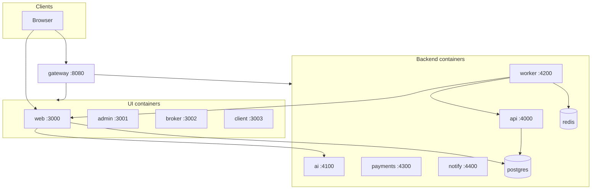

# Архитектура

## Продукт

**LBM Брокер** — AI-платформа импорта/ВЭД: AI готовит черновик (ТН ВЭД, платежи, документы), брокер подтверждает, клиент получает результат (PDF / дальше перевозка).

Репозиторий GitHub: `TikhonBaruch/Ibm-cargo` (самостоятельный продукт; Next-приложение в корне). Публичный бренд UI — **LBM Брокер**.

Каркас: [`knowledge/skeleton.md`](./knowledge/skeleton.md). Решения: [`knowledge/decisions.md`](./knowledge/decisions.md).

## Высокоуровневая схема



Поверхности и сервисы: [`containers.md`](./containers.md).  
Порядок extract: [`knowledge/containerization.md`](./knowledge/containerization.md) (D19).

## Поверхности (`containers/`)

| Поверхность | Назначение | Код UI сейчас | Папка |
|-------------|------------|---------------|-------|
| **web** | Лендинг, `/cabinet`, `/broker` | корень `app/`, `src/` | [`containers/web`](../containers/web/) |
| **admin** | Админ VED (D20) | Next app `AdminVedCabinet` | [`containers/admin`](../containers/admin/) |
| **broker** | Кабинет брокера (D16) | Next app shared `ved/broker` | [`containers/broker`](../containers/broker/) |
| **client** | Кабинет клиента (D17) | Next app shared `ved/client` | [`containers/client`](../containers/client/) |

## Сервисы

| Сервис | Роль | Папка |
|--------|------|-------|
| **api** | Domain REST extract (claim/approve/create/pay/…) | [`containers/api`](../containers/api/) |
| **ai** | Draft ТН ВЭД stub | [`containers/ai`](../containers/ai/) |
| **worker** | SLA_TICK → web/api | [`containers/worker`](../containers/worker/) |
| **payments** | Эквайринг / СБП stub | [`containers/payments`](../containers/payments/) |
| **notify** | Email / SMS / push stub | [`containers/notify`](../containers/notify/) |
| **postgres** | Локальная БД Compose | [`containers/postgres`](../containers/postgres/) |
| **redis** | Очередь / кэш | [`containers/redis`](../containers/redis/) |
| **gateway** | Nginx | [`containers/gateway`](../containers/gateway/) |

## Данные

- ORM: Prisma 6 — `prisma/schema.prisma`
- Prod: sweb `newlsu_taurus` — [knowledge/database.md](./knowledge/database.md)
- Local Compose: сервис `postgres`

## Auth

NextAuth credentials + JWT. Роли: `SUPER_ADMIN`, `ADMIN`, `EDITOR`, `SPECIALIST`, `CLIENT`, `BROKER`.  
`proxy.ts` (Node UI) + `src/lib/require-role.ts` + `src/lib/ved/access.ts` + `src/lib/ved/proxy.ts` (BFF).

## AI pipeline (целевой)

```text
ClientRequest → containers/ai (draft) → BrokerQueue → BrokerConfirm → ClientResult/PDF
```

Реальные модели не подключены. См. [knowledge/ai-pipeline.md](./knowledge/ai-pipeline.md).

## Деплой

| Среда | Как |
|-------|-----|
| Production UI | Vercel — только Next |
| Локальный стек | Docker Compose из `containers/*` |
| api / ai / worker | Docker / отдельный хост (не Vercel) |

> На машине без Docker CLI конфиги всё равно валидны; запуск — на хосте с Docker.
