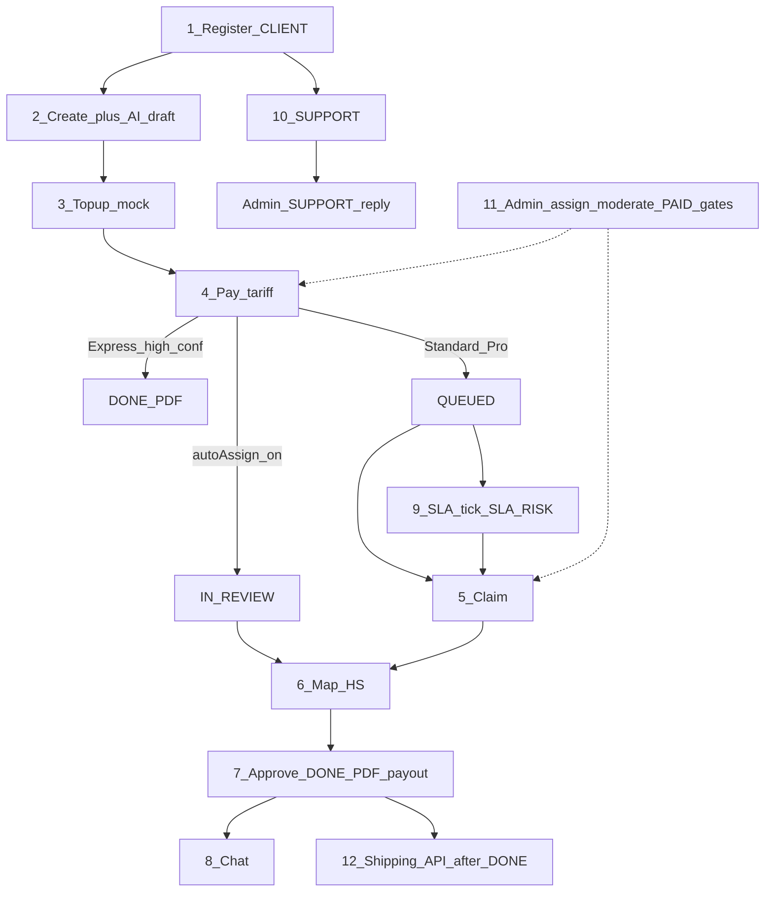

# Цепочка функционала и проверка шагов

Снимок проверки: **2026-08-07**. Unit: `npm run test:unit` (199 PASS). Live: prod `https://ibm-cargo.vercel.app`.  
Стратегия: [`plan-track-a-p0.md`](./plan-track-a-p0.md) · as-is: [`current-app.md`](./current-app.md) · ADMIN ops: [`admin-ops.md`](./admin-ops.md) (D28) · correctness: [`cabinets/shared/correctness.md`](./cabinets/shared/correctness.md).

## 1. Разделы UI (кабинеты)

### Клиент — `/cabinet`

| Раздел | Route | Роль в цепочке |
|--------|-------|----------------|
| Дашборд | `/cabinet` | Сводка заявок / CTA |
| Заявки | `/cabinet/orders` | Список + pay/PDF |
| Новый просчёт | `/cabinet/new` | Create + AI draft |
| Брокеры | `/cabinet/brokers` | Preferred broker (marketplace gate) |
| Баланс | `/cabinet/balance` | Topup |
| Поддержка | `/cabinet/support` | SUPPORT ticket + чтение ответов staff |
| Профиль | `/cabinet/profile` | Компания (`/settings` → redirect сюда) |
| Перевозка | `/cabinet/shipping` | **UI off** (`NEXT_PUBLIC_SHIPPING_UI`) |

Deep-link: `/cabinet/orders?id=<calcId>` открывает карточку и чат. Unread badge: «Заявки» + «Поддержка».

Регистрация: `/register` (D25).

### Брокер — `/broker`

| Раздел | Route | Роль |
|--------|-------|------|
| Дашборд | `/broker` | KPI |
| Очередь | `/broker/queue` | Claim QUEUED/SLA_RISK |
| Работа | `/broker/work` | Map HS + approve |
| Чат | `/broker/chat` | CALCULATION threads |
| SLA | `/broker/sla` | Риск / таймеры |
| Выплаты | `/broker/payouts` | Accrued |
| Профиль | `/broker/profile` | acceptingJobs |

### Админ — `/admin` (VED, D28)

| Раздел | Route | Роль |
|--------|-------|------|
| Дашборд | `/admin` | Attention / counters · open calc |
| Заявки | `/admin/bookings` | Assign / escalate · карточка · `?id=` |
| Клиенты | `/admin/clients` | Drill-down · ledger · ADJUSTMENT · `?company=` |
| Брокеры | `/admin/brokers` | Moderate · acceptingJobs pause |
| Тарифы | `/admin/tariffs` | price / share / SLA |
| Финансы | `/admin/finance` | Filter · CSV · Mark PAID |
| Поддержка | `/admin/support` | SUPPORT reply · nav unread badge |
| Оркестрация | `/admin/orch` | D26 snapshot · **Retry** FAILED/DEAD |
| ТН ВЭД | `/admin/tnved` | JSON batch import |
| AI / Настройки | `/admin/ai-quality`, `/settings` | Gates + confidence + feature toggles |
| Интеграции | `/admin/integrations` | Payments / LLM / **notify** health + I/O |
| Пользователи | `/admin/users` | create + reset password · без SUPER |
| Журнал | `/admin/audit` | без SUPER |

Demo: `operator@` / `admin@` = ADMIN · `demo1234`.

---

## 2. Сквозная цепочка



**Инварианты на цепочке:** D11 (нет очереди без оплаты) · D8 (одна FSM) · D10 (лимиты позиций) · D15 (реальные items, shipping только после DONE) · D13 (ledger).

---

## 3. Проверка шагов (2026-08-07)

Легенда: **PASS** = подтверждено · **PARTIAL** = домен OK, live smoke ограничен · **SKIP** = осознанно вне MVP · **FAIL** = сломан.

| # | Шаг | Unit | Live smoke | Вердикт |
|---|-----|------|------------|---------|
| 1 | Register CLIENT | `register.test.ts` PASS | `smoke:mvp` register OK | **PASS** |
| 2 | Create → AI_READY | `calculations` / `ai-draft-engine` PASS | mvp/full create OK | **PASS** |
| 3 | Topup mock | `payments` / `ledger` PASS | `smoke:payments` + mvp topup OK | **PASS** |
| 4 | Pay → QUEUED \| DONE \| autoAssign IN_REVIEW | `payCalculation` + gates PASS | mvp/full → IN_REVIEW (autoAssign) | **PASS** |
| 5 | Claim → IN_REVIEW | `claimCalculation` PASS | broker claim / mvp skip if autoAssign | **PASS** |
| 6 | Map items | `saveCalculationItems` PASS | `smoke:broker` PATCH OK | **PASS** |
| 7 | Approve → DONE + PDF | `approveCalculation` PASS | broker + mvp + full | **PASS** |
| 8 | Chat CALCULATION | `chat.test` PASS | `smoke:chat` OK | **PASS** |
| 9 | SLA tick / escalate | `runSlaTick` / `escalateSla` PASS | `smoke:sla` **401** без secret | **PARTIAL** |
| 10 | SUPPORT create + admin reply | create unit PASS; reply unit thin | нет dedicated smoke | **PARTIAL** |
| 11 | Admin assign / PAID / tariffs / gates | gates + admin-paths PASS | нет dedicated smoke | **PARTIAL** |
| 12 | Shipping after DONE | `logistics.test` PASS | `smoke:shipping` pre-DONE 400 | **PASS** reject; UI **SKIP** |

### Live прогон (prod) — финал 2026-08-07

| Script | Результат | Комментарий |
|--------|-----------|-------------|
| `test:unit` | **199 PASS** | Ядро домена |
| `smoke:mvp` | **PASS** | autoAssign → IN_REVIEW → approve DONE |
| `smoke:full` | **PASS** | autoAssign path |
| `smoke:payments` | **PASS** | mock +1500 |
| `smoke:broker` | **PASS** | map + approve |
| `smoke:chat` | **PASS** | waitingOn |
| `smoke:shipping` | **PASS** | D15 reject |
| `smoke:sla` | **FAIL auth** | Нужен `INTERNAL_API_KEY`/`CRON_SECRET` в env smoke |
| `smoke:client` | flaky network | отдельный EXPRESS path; покрыт unit + full |

---

## 4. Выводы

1. **Ядро продажи работает:** register → draft → topup → pay → (claim|autoAssign) → map → approve → PDF.
2. **На prod включён `autoAssignBrokers`** — после STANDARD pay статус сразу `IN_REVIEW`; smoke mvp/full/chat обновлены.
3. **Слабые места проверки (не обязательно баги продукта):** SLA smoke без secret; нет smoke на SUPPORT reply / admin PAID; payments/client иногда рвутся по сети Vercel.
4. **Осознанный SKIP:** shipping UI, live ЮKassa; LLM/OCR on Vercel без corpus mount — Growth / Track A. **Compose/local partial:** `smoke:chain-llm` (2026-08-12). **Vision OCR + pgvector embed** — hold до `OPENAI_API_KEY` (D30) · [`plan-ocr-vision.md`](./plan-ocr-vision.md).

### Live прогон (compose local) — 2026-08-12

| Script | Результат | Комментарий |
|--------|-----------|-------------|
| `smoke:chain-llm` | **PASS** | #47837: upload local; `llmEnrich=llm-openai-v1`; corpus classify |
| `smoke:precedent-csv` | **PASS** | second create `precedent-v1` + `skipReason=offline-hit:precedent-v1`; CSV `MATCHED_PRECEDENT` |
| `smoke:csv-import` | **PASS** | preview → create |
| `smoke:reclassify` | **PASS** | broker feedback → new HS (`llm-openai-v1`) |
| `smoke:pdf-import` | **PASS** | text-layer PDF → preview rows |
| `smoke:precedent-vector` | **SKIP** | нет `OPENAI_API_KEY` / pgvector image на compose |
| `smoke:ocr-vision` | **TODO** | engine готов; smoke + UI wire — hold (D30) |
| `smoke:full` | **PASS** | #47838: upload + enrich; autoAssign→approve→PDF |

Повторная проверка compose:
```bash
docker compose --profile full up -d --build web llm ai
npm run smoke:chain-llm
npm run smoke:precedent-csv
npm run smoke:full
```

Повторная проверка prod: `npm run test:unit` затем  
`TEST_API_URL=https://ibm-cargo.vercel.app npm run smoke:mvp && … smoke:broker && … smoke:chat && … smoke:shipping`.
